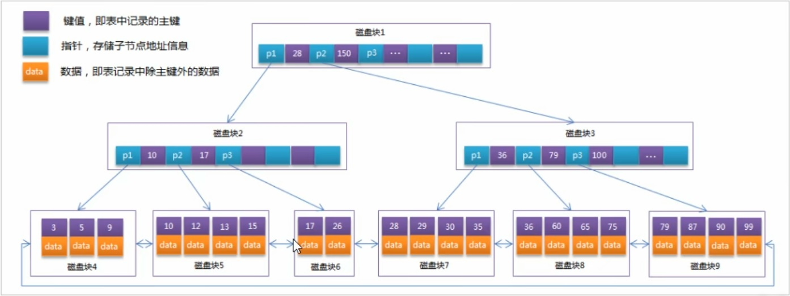

## 概述
- 索引是帮助MySQL高效获取数据得`数据结构`
- 如下图，左侧查询效率为O(1)，右侧为O(logn)


## 优劣势
- 能减少查询次数，降低IO成本，CPU消耗
- 增删改时，要更新索引信息。
- 索引其实也是一张表，需要额外空间来保存

## 索引结构

索引|InnoDB|MyISAM|Memory
:-:|:-:|:-:|:-:
B-Tree|√|√|√
Hash|×|×|√
R-Tree|×|√|×
Full-Text|>=5.6|√|×

我们所说得索引，默认是B+树索引。其中**聚合索引**、**复合索引**、**前缀索引**、**唯一索引**默认都是B+树索引，统称为索引

---

## B-Tree索引
- [B-树](/data-structure/BTree.md) [见数据结构专题]
- 在Mysql中，对B+Tree进行了优化，即`叶子节点之间增加了指针`。可以称之为`带顺序指针的B+树`。增加指针的主要目的就是便于范围搜索，`提高区间访问的性能`。如图，我想查找9~15之间的数据
- 

## 索引分类
- 单值索引
  - 一个索引只包含一个列
- 唯一索引
  - 索引值必须唯一，允许存在`多`个空值
- 复合索引
  - 一个索引包含多个列

## 语法
- 创建
  - create [unique|fulltext|spatial] index idx_name [using index_type] on table (...columns) 
  - alter table table_name add [unique|fulltext|spatial] idx_name (... columns)
- 查看
  - show index from table
- 删除
  - drop index idx_name on table

## **`设计原则`**
- 查询频次高，数据量大
- where条件
- 尽量使用唯一索引
- 索引过多，对于增删改频繁的表来说，降低效率
- 使用`短`字段索引，这是为了提高索引访问的IO效率
- 利用最左前缀

## 视图
- 虚拟的表。通俗的讲，视图就是select语句的返回集
- 优势
  - 简单。我们无须考虑结构、条件等，因为视图已经是过滤好的结果集
  - 安全。有些表、列不想暴露。通过视图开放指定的列
  - 数据独立。原表加了一列对视图没有影响，修改了列名视图需要更新一下即可
- 视图虽然能够更新，但是不建议更新。因为视图就是简化查询的。

## <font color=#A0A0A0>存储过程与函数</font>
### 概念
- 能减少数据与数据库之间的传输，提高效率
- 区别
  - 函数必须有返回值，而存储过程没有

### 语法
- 创建
```sql
    # 存储过程
    # 定义分隔符，默认是分号
    delimiter $
    create procedure my_procedure()
    begin
        select * from xxx where xxx;
        update xxx on xxx where xxx;
        ...
    end$

    ——————————————————————————————————————— 

    # 函数
    create function fun1(param int)
    returns int
    begin
        ...
    end;
```
- 调用存储过程
```sql
    call my_procedure()$
```
- 游标：存储查询结果